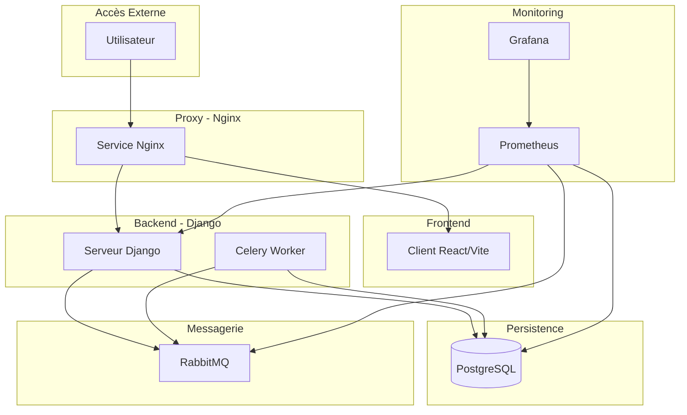

# Architecture Globale

## Vue d'ensemble de l'architecture

Le projet F_BRAIN est construit sur une architecture microservices moderne, conteneurisée et orchestrée via Docker Compose. Cette architecture permet une séparation claire des responsabilités, une maintenance simplifiée et une évolution aisée de chaque composant.

## Diagramme d'architecture

## Composants principaux

1. **Proxy (Nginx)** - Point d'entrée unique qui gère le routage des requêtes HTTP vers le frontend ou le backend.

2. **Frontend (Client)** - Application web React/Vite qui fournit l'interface utilisateur.

3. **Backend (Django)** - Serveur d'API RESTful qui implémente la logique métier et interagit avec la base de données.

4. **Celery Worker** - Traite les tâches asynchrones et planifiées.

5. **Base de données (PostgreSQL)** - Stocke les données persistantes de l'application.

6. **RabbitMQ** - File de messages qui permet la communication entre le serveur Django et les workers Celery.

7. **Monitoring (Prometheus & Grafana)** - Collecte et visualise les métriques pour surveiller la santé et les performances du système.

## Flux de communication

1. **Requêtes utilisateur**
   - Les utilisateurs accèdent à l'application via le proxy Nginx.
   - Les requêtes sont dirigées soit vers le frontend (interface utilisateur), soit vers le backend (API) selon l'URL.

2. **Communication frontend-backend**
   - Le frontend communique avec le backend via des appels API REST.
   - Ces requêtes passent par le proxy qui les route vers le serveur Django.

3. **Traitement asynchrone**
   - Le serveur Django envoie des tâches à exécuter de manière asynchrone à RabbitMQ.
   - Les workers Celery récupèrent ces tâches depuis RabbitMQ et les exécutent.

4. **Persistance des données**
   - Le serveur Django et les workers Celery interagissent avec la base de données PostgreSQL pour lire et écrire des données.

5. **Collecte de métriques**
   - Prometheus collecte des métriques depuis tous les services.
   - Grafana utilise ces métriques pour générer des tableaux de bord de monitoring.

## Architecture réseau

Tous les services sont connectés sur un réseau Docker Bridge nommé `backend`, ce qui permet une isolation du trafic inter-services et une communication par nom de service.

## Volumes et persistance

Le projet utilise trois volumes Docker pour assurer la persistance des données :
- `pgdata` - Pour les données PostgreSQL
- `prometheus_data` - Pour les métriques collectées par Prometheus
- `grafana_data` - Pour les configurations et tableaux de bord Grafana

## Considérations de sécurité

1. **Variables d'environnement** - Les informations sensibles comme les mots de passe sont gérées via des variables d'environnement définies dans le fichier `.env`.

2. **Isolation réseau** - L'utilisation d'un réseau bridge isolé protège les services contre les accès non autorisés depuis l'extérieur.

3. **Exposition contrôlée des ports** - Seuls les ports strictement nécessaires sont exposés à l'hôte.

Les sections suivantes de la documentation détailleront chacun de ces composants, leurs configurations et leurs interactions spécifiques.
