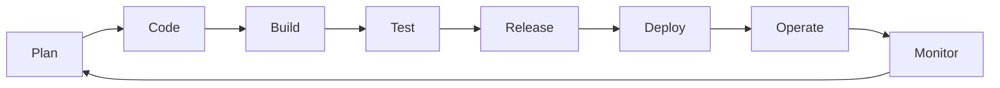

# Flux de travail DevOps

## Introduction aux pratiques DevOps dans F_BRAIN

Le projet F_BRAIN adopte une approche DevOps moderne qui vise à intégrer harmonieusement le développement (Dev) et les opérations (Ops) à travers l'ensemble du cycle de vie de l'application. Cette section détaille les flux de travail, outils et pratiques DevOps mis en œuvre dans le projet.

## Le cycle DevOps complet

Le cycle DevOps implémenté dans F_BRAIN comprend les phases suivantes :



## Outils et technologies DevOps

### Conteneurisation et orchestration
- **Docker** : Conteneurisation de tous les services
- **Docker Compose** : Orchestration des conteneurs en environnement de développement et de test
- **Dockerfile** : Définition des images pour chaque service

### Intégration continue (CI) et livraison continue (CD)
- **Tests automatisés** : Tests unitaires et d'intégration
- **Linting et qualité de code** : Analyses statiques pour maintenir la qualité
- **Builds automatisés** : Construction automatique des images Docker

### Infrastructure as Code (IaC)
- **Docker Compose** : Configuration déclarative de l'infrastructure
- **Variables d'environnement** : Paramétrage externalisé via `.env`

### Surveillance et observabilité
- **Prometheus** : Collecte des métriques
- **Grafana** : Visualisation des tableaux de bord et alertes

## Les différentes phases du flux de travail

### 1. Planification (Plan)

Cette phase implique la planification des fonctionnalités, améliorations et corrections à apporter au projet.

**Pratiques recommandées**:
- Utiliser un système de suivi des tickets (Jira, GitHub Issues, etc.)
- Adopter une méthodologie agile (Scrum, Kanban)
- Organiser des réunions de planification régulières

### 2. Développement (Code)

Dans cette phase, les développeurs écrivent le code qui implémente les fonctionnalités planifiées.

**Pratiques recommandées**:
- Suivre les conventions de codage établies
- Utiliser le versionnement avec Git
- Appliquer les principes de revue de code
- Mettre en œuvre des branches par fonctionnalité (feature branches)

**Workflow Git recommandé**:
```
main       : o---o---o---o---o
              \         /
feature    :   o---o---o
```

### 3. Construction (Build)

Cette étape concerne la construction des artefacts de l'application à partir du code source.

**Pratiques recommandées**:
- Construire les images Docker via `docker-compose build`
- Versionner les images Docker avec des tags significatifs
- Optimiser les Dockerfiles pour des builds rapides

**Commandes essentielles**:
```bash
# Construction des images
docker-compose build

# Construction d'un service spécifique
docker-compose build web
```

### 4. Test

Les tests automatisés valident que l'application fonctionne comme prévu.

**Pratiques recommandées**:
- Maintenir une suite de tests unitaires pour chaque service
- Implémenter des tests d'intégration entre les services
- Exécuter des tests de performances pour les fonctionnalités critiques

**Commandes essentielles**:
```bash
# Exécution des tests Django
docker-compose run --rm web python manage.py test

# Tests de charge avec un outil comme k6
k6 run load-tests/performance.js
```

### 5. Publication (Release)

Préparation des artefacts validés pour le déploiement en production.

**Pratiques recommandées**:
- Tagger les versions dans Git
- Publier les images Docker dans un registre (DockerHub, GitHub Container Registry, etc.)
- Générer des notes de version

**Commandes essentielles**:
```bash
# Tagging d'une version
git tag v1.0.0
git push origin v1.0.0

# Publication des images Docker
docker-compose push
```

### 6. Déploiement (Deploy)

Mise en production de la nouvelle version de l'application.

**Pratiques recommandées**:
- Automatiser le déploiement autant que possible
- Utiliser des stratégies de déploiement sécurisées (blue-green, canary)
- Prévoir des procédures de rollback en cas de problème

**Commandes essentielles**:
```bash
# Déploiement en production
docker-compose -f docker-compose.yml -f docker-compose.prod.yml up -d

# Rollback vers une version précédente
docker-compose -f docker-compose.yml -f docker-compose.prod.yml down
git checkout v0.9.0
docker-compose -f docker-compose.yml -f docker-compose.prod.yml up -d
```

### 7. Opérations (Operate)

Gestion quotidienne de l'application en production.

**Pratiques recommandées**:
- Documenter les procédures opérationnelles
- Automatiser les tâches récurrentes
- Mettre en place une rotation des logs

**Commandes essentielles**:
```bash
# Vérification de l'état des services
docker-compose ps

# Redémarrage d'un service spécifique
docker-compose restart web
```

### 8. Surveillance (Monitor)

Surveillance continue de l'application pour détecter et résoudre les problèmes.

**Pratiques recommandées**:
- Configurer des alertes pour les métriques critiques
- Analyser régulièrement les tendances dans les métriques
- Mettre en œuvre une journalisation structurée

**Outils de surveillance**:
- **Prometheus** pour la collecte de métriques
- **Grafana** pour la visualisation et les alertes
- Logs centralisés (peut être ajouté via ELK Stack ou similaire)

## Automatisation du pipeline CI/CD

Un exemple de pipeline CI/CD pour F_BRAIN pourrait inclure les étapes suivantes :

1. **Déclenché par** : Push sur une branche, création d'une Pull Request
2. **Étapes**:
   - Linting et analyse statique du code
   - Construction des images Docker
   - Exécution des tests unitaires
   - Exécution des tests d'intégration
   - Publication des images Docker (uniquement pour la branche main)
   - Déploiement automatique en environnement de test

**Exemple de fichier de configuration CI/CD** (GitHub Actions):

```yaml
name: F_BRAIN CI/CD Pipeline

on:
  push:
    branches: [ main, develop ]
  pull_request:
    branches: [ main, develop ]

jobs:
  lint:
    name: Lint Code
    runs-on: ubuntu-latest
    steps:
      - uses: actions/checkout@v3
      - name: Set up Python
        uses: actions/setup-python@v4
        with:
          python-version: '3.11'
      - name: Install dependencies
        run: |
          python -m pip install --upgrade pip
          pip install flake8 black
      - name: Lint with flake8
        run: flake8 ./server
      - name: Format check with black
        run: black --check ./server

  build-and-test:
    name: Build and Test
    runs-on: ubuntu-latest
    needs: lint
    steps:
      - uses: actions/checkout@v3
      - name: Build Docker images
        run: docker-compose build
      - name: Run tests
        run: docker-compose run --rm web python manage.py test

  deploy-test:
    name: Deploy to Test
    if: github.ref == 'refs/heads/develop'
    runs-on: ubuntu-latest
    needs: build-and-test
    steps:
      - name: Deploy to test environment
        # Étapes de déploiement en environnement de test

  deploy-prod:
    name: Deploy to Production
    if: github.ref == 'refs/heads/main'
    runs-on: ubuntu-latest
    needs: build-and-test
    steps:
      - name: Deploy to production
        # Étapes de déploiement en production
```

## Meilleures pratiques DevOps pour F_BRAIN

1. **Infrastructure as Code (IaC)** - Gérer toute l'infrastructure comme du code versionné
2. **Monitoring complet** - Surveiller non seulement les aspects techniques mais aussi les métriques métier
3. **Automatisation maximale** - Automatiser chaque étape du pipeline pour minimiser les erreurs humaines
4. **Déploiements fréquents et petits** - Privilégier de petits changements fréquents plutôt que de grandes mises à jour
5. **Tests automatisés** - Maintenir une couverture de tests élevée pour garantir la qualité
6. **Boucle de feedback rapide** - Mettre en place des mécanismes pour identifier et corriger rapidement les problèmes
7. **Documentation continue** - Garder la documentation à jour avec chaque changement
8. **Sécurité intégrée** - Intégrer les tests de sécurité dans le pipeline CI/CD

## Évolution du flux de travail DevOps

Le flux de travail DevOps n'est pas statique et doit évoluer avec le projet. Voici quelques pistes d'amélioration pour F_BRAIN :

1. **Orchestration Kubernetes** - Migration de Docker Compose vers Kubernetes pour une meilleure mise à l'échelle
2. **Tests de chaos** - Introduction de tests de résilience pour valider la robustesse de l'application
3. **Observabilité avancée** - Ajout de traçage distribué (par exemple avec Jaeger ou Zipkin)
4. **Gestion avancée des secrets** - Mise en œuvre d'un gestionnaire de secrets comme HashiCorp Vault
5. **Déploiement progressif** - Implémentation de techniques comme le Canary Deployment ou le Feature Flagging

## Ressources additionnelles

- [The DevOps Handbook](https://itrevolution.com/books/the-devops-handbook/) - Guide pratique sur l'implémentation DevOps
- [Docker Documentation](https://docs.docker.com/) - Documentation officielle de Docker
- [GitHub Actions Documentation](https://docs.github.com/en/actions) - Pour l'automatisation CI/CD avec GitHub
- [DevOps Roadmap](https://roadmap.sh/devops) - Guide d'apprentissage des compétences DevOps
