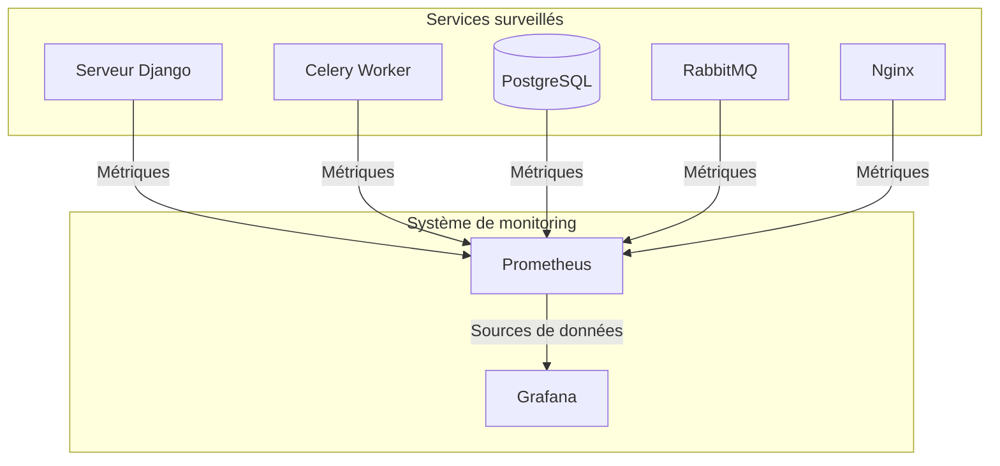

# Surveillance et monitoring

## Aperçu

Le système de surveillance et monitoring de l'application F_BRAIN est un élément crucial de l'architecture DevOps. Il permet de suivre en temps réel les performances et la santé des différents services, de détecter les problèmes avant qu'ils n'affectent les utilisateurs, et de collecter des données essentielles pour l'optimisation continue de l'application.

Ce système est principalement basé sur deux outils complémentaires :
1. **Prometheus** - Pour la collecte et le stockage des métriques
2. **Grafana** - Pour la visualisation des données et la création de tableaux de bord

## Fonctionnalités principales

- **Surveillance en temps réel** des services et de l'infrastructure
- **Alertes automatisées** en cas de problèmes détectés
- **Tableaux de bord personnalisables** pour différents besoins et utilisateurs
- **Métriques historiques** pour analyser les tendances et planifier les capacités
- **Observabilité complète** à travers les différentes couches de l'application

## Architecture de la surveillance



## Types de métriques collectées

1. **Métriques système**
   - Utilisation CPU
   - Consommation mémoire
   - Utilisation disque
   - Charge système

2. **Métriques d'application**
   - Temps de réponse des requêtes HTTP
   - Nombre de requêtes par seconde
   - Taux d'erreurs
   - Statut des tâches Celery

3. **Métriques de base de données**
   - Temps d'exécution des requêtes
   - Nombre de connexions
   - Taille des tables
   - Opérations d'écriture/lecture

4. **Métriques de messagerie**
   - Longueur des files d'attente
   - Taux de traitement des messages
   - Latence des messages
   - Statut du broker

## Configuration dans docker-compose.yml

La configuration de Prometheus et Grafana est définie dans le fichier docker-compose.yml :

```yaml
grafana:
  image: grafana/grafana:latest
  env_file: .env
  restart: always
  ports:
    - "3003:3000"
  environment:
    GF_SECURITY_ADMIN_USER: ${GF_SECURITY_ADMIN_USER:-admin}
    GF_SECURITY_ADMIN_PASSWORD: ${GF_SECURITY_ADMIN_PASSWORD:-admin}
  volumes:
    - ./grafana.ini:/etc/grafana/grafana.ini:ro
    - grafana_data:/var/lib/grafana
  networks: [backend]
  depends_on:
    prometheus:
      condition: service_healthy

prometheus:
  image: prom/prometheus:latest
  ports:
    - "9090:9090"
  volumes:
    - ./prometheus.yml:/etc/prometheus/prometheus.yml:ro
    - prometheus_data:/prometheus
  networks: [backend]
  healthcheck:
    test: ["CMD-SHELL", "wget --spider http://localhost:9090/-/ready"]
    interval: 30s
    timeout: 10s
    retries: 3
```

## Accès aux interfaces de monitoring

- **Grafana** : http://localhost:3003 (Identifiants par défaut : admin/admin)
- **Prometheus** : http://localhost:9090

## Pour en savoir plus

Pour des informations détaillées sur chaque composant du système de monitoring, veuillez consulter :

- [Prometheus](./07a-prometheus.md) - Pour la collecte et le stockage des métriques
- [Grafana](./07b-grafana.md) - Pour la visualisation et les tableaux de bord
